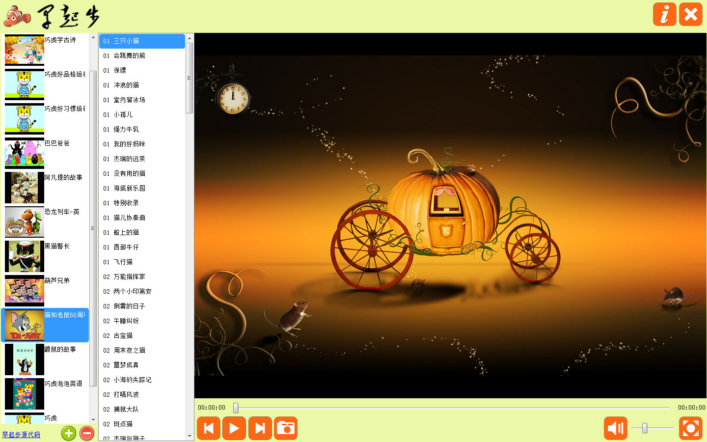
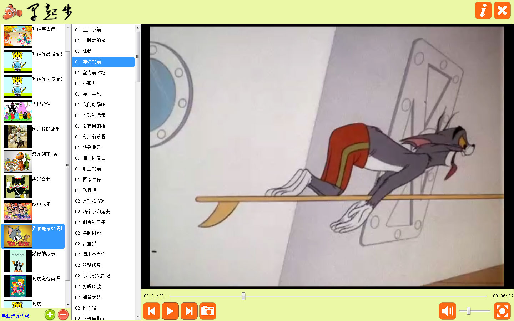
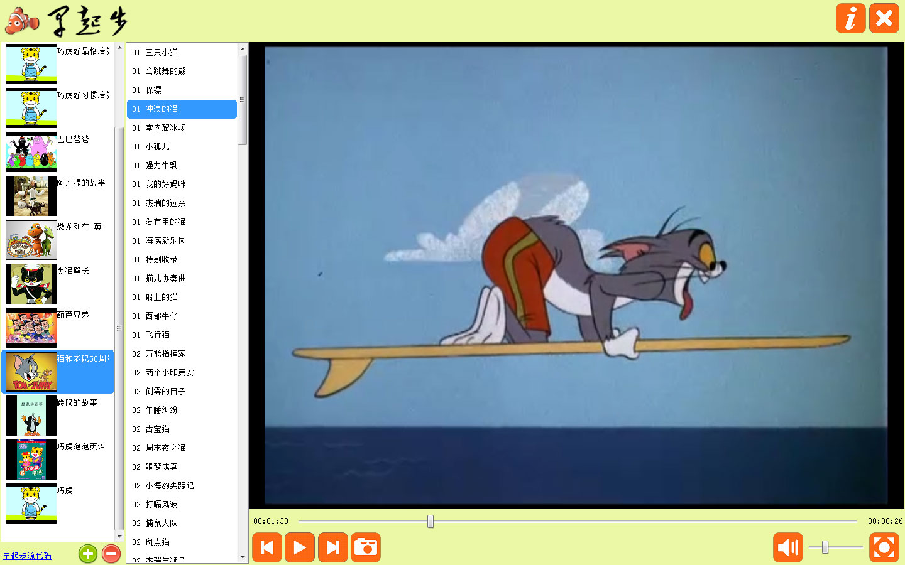
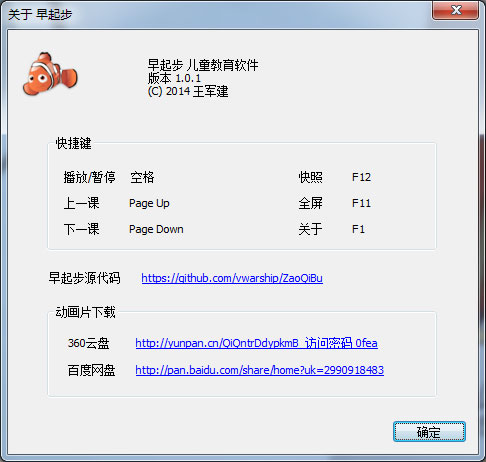

# 早起步-动画片播放器

##介绍
主要目标是想让儿童可以以最好的体验来看动画片。
主要功能：
1、支持记录每一部动画片的当前播放位置，方便下次打开的时候可以接着看。
2、可以增加片头、片尾的时间点，不用每次都播放重复内容。
3、播放、暂停、上一集、下一集、快照、全屏等。

##主界面

##播放动画片

##重新打开程序后接着上次的播放

##关于
提供了功能的快捷键和已经整理好的动画片资源。
